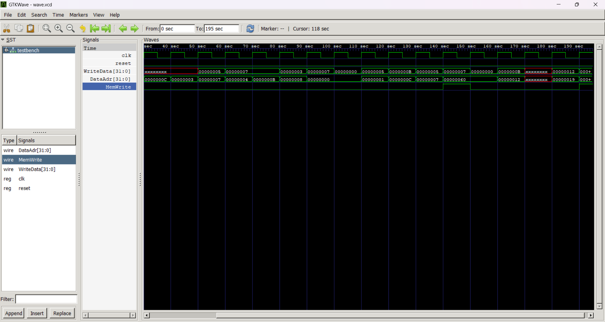
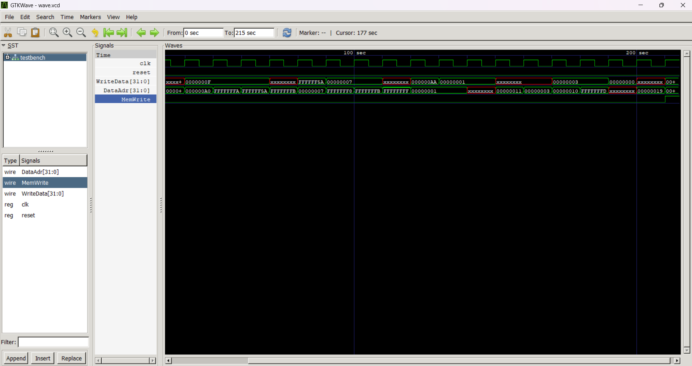

# RVX10 - 10 New Single-Cycle instruction to the RV32I core
## Goal 
extend single-cycle RV32I core with 10 new instruction - RVX10
use the reserved CUSTOM -0 opcode (0x0B)
    - single cycle
    - use existing datapath elements (adder, shifter, etc.)
    - no new CSRs, write results back only to register file
### success 
    final testbench - 25 store at memory 100
## 📂 Project Structure
```
riscv_single/
│
├── src/
│ └── riscv_single.sv # modified single-cycle core (ALU + decode)
│
├── docs/
│ ├── ENCODINGS.md # binary + hex encodings of RVX10 ops
│ ├── TESTPLAN.md # test strategy & expected outputs
│
├── tests/
│ ├── rvx10.S # assembly test program
│ └── rvx10.hex # compiled memory image for simulation
│
└── README.md # build & run instructions
```

# output

## the Waveform 
using gtkwave
### riscvtest.txt test file of RISCV32I 
To verify the working of the 5 bit coversion from 3 bit. The riscvsingle works on previous test cases.


### rvx10.txt test file 
the new test written for the verifying ther new instruction 




## modify RTL (risvsingle.sv)

## ⚙️ Build & Simulation Instructions


### Run Simulation
using Icarus verilog

```bash
iverilog -g2012 -o simv src/riscv_single.sv tb/tb_riscv_single.sv
vvp simv
```
```

to add 10 new ops:

we need to add a new opcode, CUSTOM-0 = 0x0B (0001011b) accroding to the assigment brief.

we’ll also expand ALUControl from 3 bits to 5 bits so there’s enough room for all the new operations.

Then, update maindec so it marks CUSTOM-0 as an ALU-type operation (so no mem, branch or jump).

Next, make aludec understand how to decode CUSTOM-0 using (funct7, funct3) combos to map them into the 10 new 5-bit ALU codes.

Finally, we need to implement those 10 new ops inside the alu itself — these are ANDN, ORN, XNOR, MIN, MAX, MINU, MAXU, ROL, ROR, and ABS — all with correct semantics. (rotate by 0 should just passthrough, and ABS should use two’s complement wrap).
```
